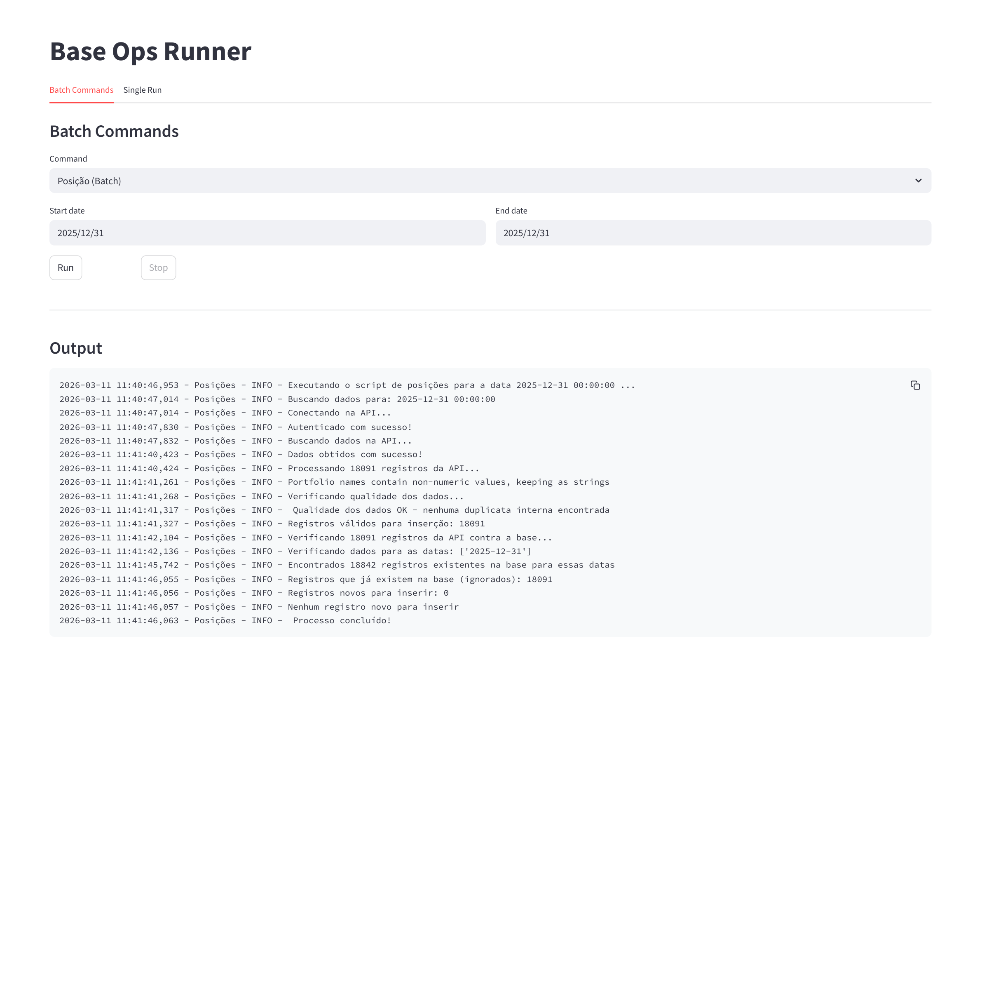
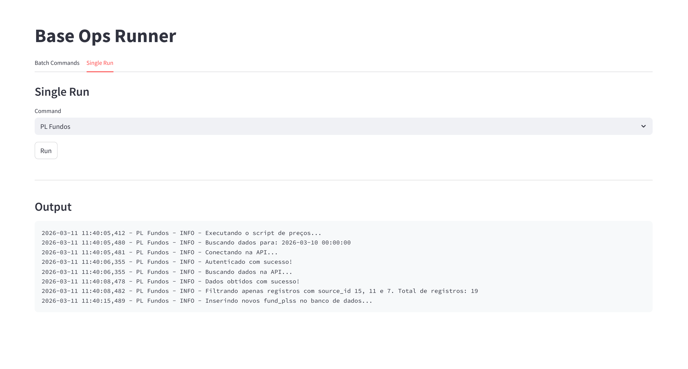

# OPS — Fund Data Pipeline

Sistema para gerenciamento de dados de fundos usando a API Maravi, com interface web para execução interativa dos pipelines.

---

## Configuração do Ambiente

### 1. Criar ambiente virtual

```console
conda create -n ops python=3.12
conda activate ops
```

### 2. Instalar dependências

```console
pip install -r requirements.txt
```

### 3. Configurar variáveis de ambiente

Copie o arquivo `.env.example` para `.env` e preencha com suas credenciais:

```console
copy .env.example .env
```

Edite o arquivo `.env`:

```
MARAVI_USER=seu_usuario@exemplo.com
MARAVI_PASS=sua_senha
MARAVI_CLIENT_ID=seu_client_id
MARAVI_CLIENT_SECRET=seu_client_secret

DB_HOST=ip_do_servidor
DB_USER=seu_usuario_db
DB_PASS=sua_senha_db
DB_BASE=nome_do_banco
```

---

## Interface Web (Streamlit)

A forma recomendada de usar o sistema é pela interface web:

```console
streamlit run app.py
```

A interface tem duas abas:

### Batch Commands

Executa um pipeline para um intervalo de datas. Selecione o comando, defina as datas de início e fim, e clique **Run**. O botão **Stop** interrompe o processo ao fim da iteração corrente.



### Single Run

Executa um pipeline para a data de hoje (último dia útil disponível).



---

## CLI

O sistema também pode ser usado via linha de comando:

```console
# Execução simples (data de hoje)
python manage.py posicao
python manage.py movimentacao
python manage.py prices
python manage.py pls
python manage.py operations
python manage.py carteiras

# Execução em lote com datas padrão
python manage.py posicao_batch
python manage.py movimentacao_batch
python manage.py prices_range
python manage.py pls_batch
python manage.py operations_batch
python manage.py carteiras_batch

# Execução em lote com intervalo customizado
python manage.py posicao_batch --start 2025-01-01 --end 2025-12-31
python manage.py movimentacao_batch --start 2025-07-01 --end 2025-09-30
```

---

## Pipelines Disponíveis

| Comando | Descrição | Granularidade |
|---|---|---|
| `posicao` / `posicao_batch` | Posições de portfólio | Último dia útil do mês |
| `carteiras` / `carteiras_batch` | Carteiras | Último dia útil do mês |
| `movimentacao` / `movimentacao_batch` | Movimentações | Dia útil |
| `prices` / `prices_range` | Preços | Dia útil |
| `pls` / `pls_batch` | PL dos fundos | Dia útil |
| `operations` / `operations_batch` | Operações TPE | Dia útil |
